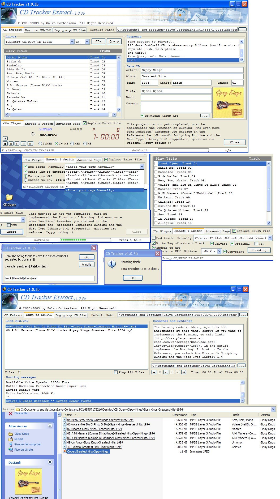



## Example how to Extract Audio Tracks from Media CDW/DVDW

### Description

Project example how to extract audio tracks from media CDW/DVDW, and convert it to MP3 or WAV! The project use the Library NeroCOM and other DLLs that are included in the zip file! The option of Burning in this project is NOT implemented. For more info goto this Link: http://www.planet-source-code.com/vb/scripts/ShowCode.asp?txtCodeId=71884&amp;lngWId=1!If you not found the DLLs in the file zip, you can Download them from this link: http://www.netshadows.it/CD Tracker.rar. Remember before you Run this project, goto VB Referenze and checked the: Microsoft Scripting Runtime, Nero 1.4 Type Library, Lame4VB-EBArtSoft WinApi Declaration! You must also reg the OCX (utcCover.ocx), and put the DLL (vbzlib1.dll) into your System32 path! The other DLLs should be in the path of the project! Suggestion and question are welcom, happy conding!
 
### More Info
 

             |
---                |---
**Submitted On**   |2009-03-22 22:59:48
**By**             |[Salvo Cortesiano \(Italy\)](https://github.com/Planet-Source-Code/PSCIndex/blob/master/ByAuthor/salvo-cortesiano-italy.md)
**Level**          |Intermediate
**User Rating**    |5.0 (15 globes from 3 users)
**Compatibility**  |VB 6\.0
**Category**       |[Complete Applications](https://github.com/Planet-Source-Code/PSCIndex/blob/master/ByCategory/complete-applications__1-27.md)
**World**          |[Visual Basic](https://github.com/Planet-Source-Code/PSCIndex/blob/master/ByWorld/visual-basic.md)
**Archive File**   |[Example\_ho2147553232009\.zip](https://github.com/Planet-Source-Code/salvo-cortesiano-italy-example-how-to-extract-audio-tracks-from-media-cdw-dvdw__1-71897/archive/master.zip)

